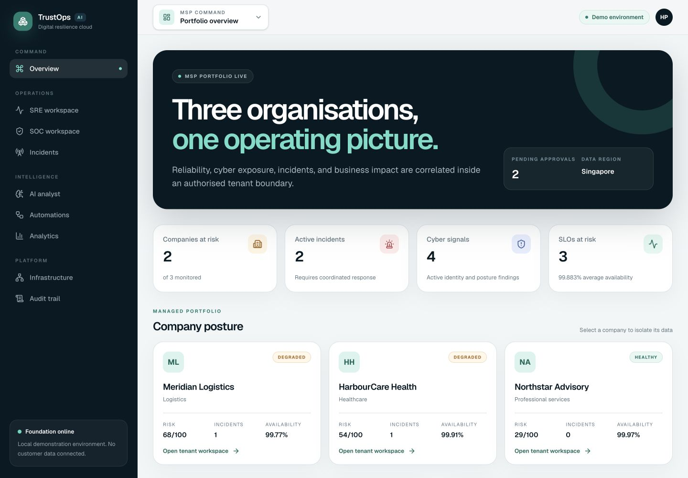
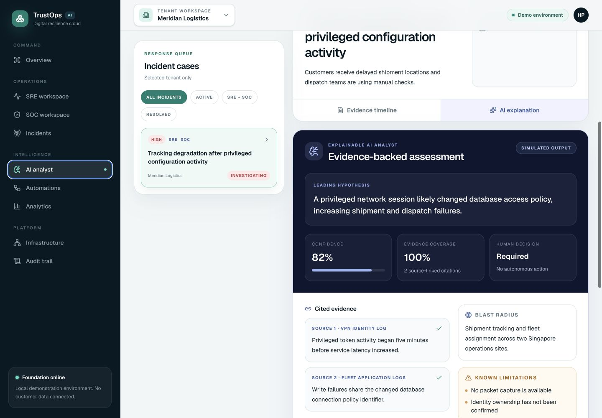
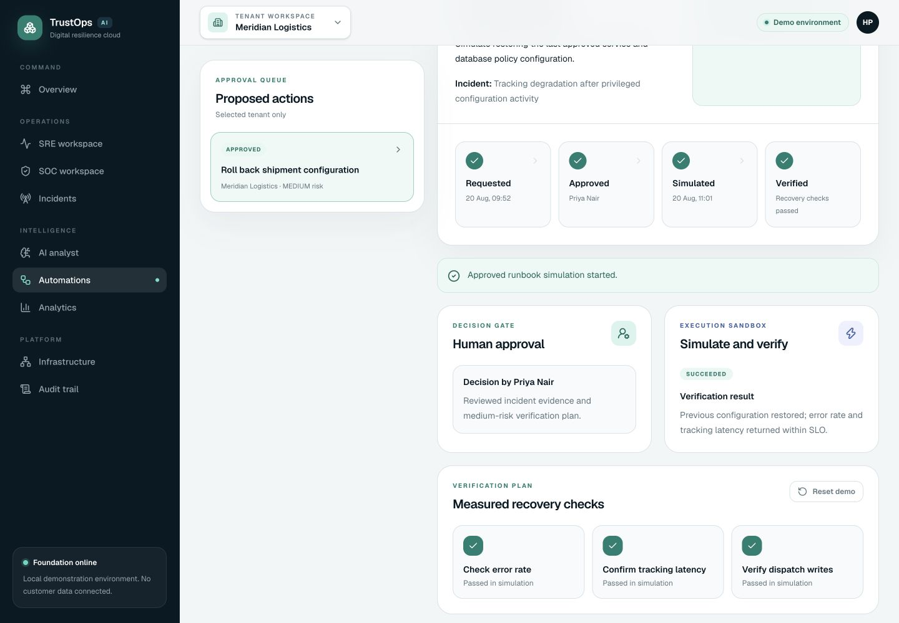
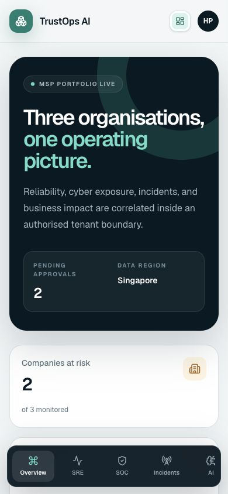

# TrustOps AI

[](https://github.com/HninPhyuPhyuAye/TrustOps/actions/workflows/ci.yml)

TrustOps AI is a multi-tenant digital resilience platform for
Singapore SMEs and managed service providers. It brings SRE observability, SOC
monitoring, incident analysis, and human-approved automation into one command
centre.

## Product promise

When an operational failure and a security signal happen at the same time,
TrustOps correlates the evidence into one incident, explains the likely business
impact, recommends an approved runbook, and verifies recovery without allowing
an AI agent to make uncontrolled production changes.

## Target users

- SME and mid-market IT teams
- Managed service providers (MSPs)
- Managed security service providers (MSSPs)
- SRE, SOC, support, and infrastructure engineers
- Technology and risk leaders

## Initial industry demonstrations

- Logistics and supply chain
- Private healthcare
- Professional services

## Demonstrated workflow

```text
Tenant-scoped telemetry
  -> correlated SRE + SOC incident
  -> evidence-linked simulated AI investigation
  -> role and tenant policy evaluation
  -> human approval or rejection
  -> controlled runbook simulation
  -> recovery verification + audit evidence
```

## Product tour

| Workspace | What it demonstrates |
| --- | --- |
| Command centre | Cross-company MSP posture with isolated tenant drill-down |
| SRE | Golden signals, SLO burn, deployments, logs, traces, and readiness |
| SOC | Identity, endpoint, cloud, network, MITRE, exposure, and controls |
| Incidents and AI | Correlated timeline, cited hypothesis, uncertainty, and blast radius |
| Automations | Role/tenant policy, written human decision, safe simulation, verification |
| Audit and infrastructure | Attributed event chain and full-cloud architecture visibility |

## Release screenshots

### Multi-tenant command centre



### Evidence-backed AI investigation



### Approval-controlled automation



### Responsive mobile view



## Two-day MVP

The two-day build is an intentionally focused demonstration. It simulates
realistic telemetry and response workflows while keeping the interfaces clean
enough to connect to real collectors and cloud services later.

See [docs/DELIVERY_PLAN.md](docs/DELIVERY_PLAN.md) for the detailed scope,
acceptance criteria, and delivery order.

## Engineering stack

- Next.js App Router and React
- TypeScript
- Tailwind CSS
- PostgreSQL-compatible domain model
- Recharts for operational visualisation
- Zod for runtime validation
- Vitest and Testing Library
- Docker and GitHub Actions
- Terraform reference architecture for AWS

## Run locally

Requirements: Node.js 24 and npm 11 or later.

```bash
cp .env.example .env.local
npm ci
npm run dev
```

Open `http://localhost:3000`. The operational health endpoint is available at
`http://localhost:3000/api/health`.

Run the full local quality gate with:

```bash
npm run verify
npm audit --omit=dev --audit-level=high
```

## Run the production container

With Docker Desktop running:

```bash
docker compose build
docker compose up -d
curl --fail http://localhost:3000/api/health
```

The multi-stage image runs the minimal Next.js standalone server as an
unprivileged user. See the [container release runbook](docs/runbooks/CONTAINER_RELEASE.md)
for verification and shutdown steps.

## Safety boundary

The AI layer prepares evidence-backed recommendations. A deterministic policy
engine and an authorised human must approve consequential automation. Every
approval and runbook execution is recorded in an audit trail.

## Cloud delivery rule

AWS integrations will be represented as reviewed Terraform infrastructure as
code. The project will not depend on manually created console resources, and no
chargeable infrastructure is provisioned by default.

The reference configuration models VPC networking, ECS Fargate, ECR, an ALB,
private encrypted RDS, CloudWatch, alarms, and least-privilege runtime roles. Both
`deployment_enabled` and `cost_acknowledged` default to `false`; CI validates the
configuration and never applies it. See [the AWS architecture](docs/AWS_ARCHITECTURE.md)
and [safe Terraform instructions](infra/terraform/README.md).

## Delivery evidence

- [Marketplace position](docs/MARKETPLACE_POSITION.md)
- [Portfolio case study](docs/PORTFOLIO_CASE_STUDY.md)
- [Interview and demonstration guide](docs/INTERVIEW_GUIDE.md)
- [Threat model](docs/THREAT_MODEL.md)
- [AWS reference architecture](docs/AWS_ARCHITECTURE.md)
- [AI investigation contract](docs/AI_INVESTIGATION.md)
- [Automation safety model](docs/AUTOMATION_SAFETY.md)
- [CI pipeline](docs/CI_PIPELINE.md)
- [Security policy](SECURITY.md)
- [Local development runbook](docs/runbooks/LOCAL_DEVELOPMENT.md)
- [Incident response runbook](docs/runbooks/INCIDENT_RESPONSE.md)
- [Terraform review runbook](docs/runbooks/TERRAFORM_REVIEW.md)
- [Controlled teardown runbook](docs/runbooks/TEARDOWN.md)
- [Release checklist](docs/RELEASE_CHECKLIST.md)

## Portfolio safety statement

TrustOps uses fixed synthetic telemetry and deterministic simulated AI output.
It does not connect to customer systems, call a live model, or execute real
infrastructure changes. The production evolution and residual risks are stated
explicitly in the threat model and architecture documents.

## Status

Tasks 1–10 complete. TrustOps is an interview-ready portfolio release with the
full multi-tenant SRE/SOC workflow, explainable AI safety contract,
approval-controlled automation, hardened delivery path, threat model,
marketplace position, interview handoff, and reproducible infrastructure
reference. The Terraform default produces a zero-resource plan and no AWS
resource is required to demonstrate the application.
