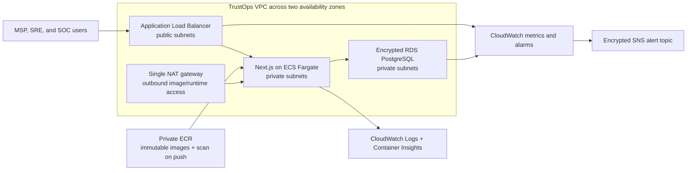

# AWS reference architecture

## Intent

This is a reviewed infrastructure-as-code reference for evolving TrustOps from
synthetic browser data to a managed AWS workload. It is not an active deployment.
The committed configuration creates **zero resources by default**, requires no
AWS account for CI validation, and contains no backend, account ID, credentials,
certificate, domain, or customer data.

## Architecture



## Terraform modules

| Module | Responsibilities |
| --- | --- |
| `network` | VPC, two public subnets, two private subnets, route tables, internet gateway, and one NAT gateway |
| `platform` | ECR, ECS cluster/service/task, non-public RDS, ALB, security groups, IAM roles, logs, and autoscaling |
| `monitoring` | CloudWatch dashboard, ECS/ALB/RDS alarms, and an encrypted SNS alert topic |

The ECS execution role receives only the AWS-managed permissions needed to pull
images and publish logs. The application task role intentionally has no
application permissions yet. A future real adapter must add narrowly scoped
permissions and retrieve secrets at runtime; credentials must never be embedded
in an image or Terraform variable file.

## Safety and cost gates

Two independent variables protect against accidental deployment:

```hcl
deployment_enabled = false
cost_acknowledged  = false
```

All resource blocks use `deployment_enabled`. A Terraform check rejects an
enabled configuration unless `cost_acknowledged` is also true. CI runs only
formatting, initialization, and validation. It never runs an AWS plan with real
credentials and never runs `terraform apply`.

Major cost drivers in an enabled environment are the NAT gateway, load balancer,
Fargate tasks, Multi-AZ RDS instance, log ingestion, and retained metrics. Review
current AWS pricing, data transfer, expected telemetry volume, and retention
before changing either safety flag.

## Availability and recovery

- Public and private subnets span two availability zones.
- The desired ECS count is two, with CPU target tracking from two to six tasks.
- ECS deployment circuit breaking automatically rolls back an unhealthy task set.
- ALB and container health checks use `/api/health`.
- RDS defaults to Multi-AZ, encrypted storage, managed master credentials,
  seven-day backups, deletion protection, and a required final snapshot.
- ECR tags are immutable and the lifecycle policy retains the latest 20 images.
- Logs are retained for 30 days in the reference environment.

## Production gaps that remain intentional

Before production use, an engineering team must add:

- Route 53, ACM TLS, HTTP-to-HTTPS redirection, and an approved WAF policy;
- enterprise identity, session management, tenant entitlements, and MFA;
- the real PostgreSQL repository and migration process;
- Secrets Manager permissions and rotation for application secrets;
- a remote encrypted Terraform backend with state locking and restricted access;
- per-environment accounts, SCPs, deployment roles, and approval environments;
- CloudTrail, GuardDuty/Security Hub integration, immutable audit archival, and
  tested recovery objectives;
- private service endpoints or a multi-AZ egress design where justified;
- privacy, retention, data residency, and incident notification review.

The current HTTP listener exists only to keep the architecture independently
validatable. It must not serve real users or data.
