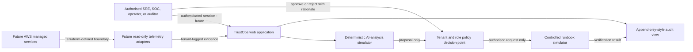

# TrustOps threat model

## Scope and assumptions

This model covers the portfolio application, its synthetic tenant data,
approval-controlled automation simulation, container delivery, and the disabled
AWS reference architecture. The current build has no production identity
provider, telemetry collectors, customer data, model endpoint, or execution
worker. Those are explicit production gaps, not hidden claims.

Protected properties are tenant confidentiality, decision integrity, service
availability, actor accountability, audit provenance, and the separation
between recommendation and execution.

## Data flow and trust boundaries

Primary trust boundaries are browser-to-application, tenant-to-tenant,
collector-to-ingestion, analyst-to-policy engine, policy-to-executor,
application-to-database, and CI-to-cloud deployment credentials.

## Threat analysis

| Threat | Example abuse | Current control | Production control required |
| --- | --- | --- | --- |
| Spoofing | Attacker acts as a tenant admin | Roles and actors are fixed synthetic fixtures | Enterprise SSO, MFA, short sessions, workload identity, device/risk checks |
| Tenant data disclosure | A crafted identifier reveals another customer's incident | Repository methods filter by organisation; integrity tests reject cross-tenant references | Server-side authorisation on every query, PostgreSQL RLS, tenant-scoped encryption and tests |
| Evidence tampering | A signal or AI citation is changed to justify action | Dataset validation and deterministic fixtures | Signed ingestion, schema validation, provenance, immutable raw-event storage |
| Unsafe automation | AI recommendation executes without authority | AI is advisory; policy gate, mandatory rationale, human approval, simulated executor | Separate policy service, short-lived credentials, allow-listed runbooks, two-person control for high risk |
| Audit repudiation | Operator denies approving a change | Attributed events and chained demonstration checksums | Append-only/WORM storage, trusted timestamps, KMS signing, CloudTrail and retention policy |
| Prompt or retrieval injection | Malicious telemetry instructs an AI agent to run commands | No live model or retrieval execution; visible simulated output | Treat telemetry as untrusted, structured tool contracts, content isolation, output policy and model evaluation |
| Secret disclosure | Credentials enter source, image, log, or Terraform state | Environment/state exclusions, minimal container, no committed credentials | Secrets Manager, rotation, redaction, secret scanning, least-privilege workload roles |
| Supply-chain compromise | Malicious dependency or CI action enters release | Lockfile, npm audit, Dependabot, pinned major action versions, Trivy image scan | Digest-pinned actions/images, SBOM, provenance signing, protected environments and attestations |
| Denial of service | Telemetry flood exhausts ingestion or dashboards | Synthetic bounded dataset only | Rate limits, queues, backpressure, autoscaling, quotas, circuit breakers and cost alarms |
| Availability-zone failure | A service or database failure removes the platform | Reference spans two AZs; ECS count two; RDS Multi-AZ default | Tested failover, defined RTO/RPO, backup restore exercises and multi-AZ egress decision |
| Public-path attack | Internet traffic exploits the app or dependencies | Local-only Compose binding; no active cloud deployment | TLS, WAF, secure headers, authenticated routes, DDoS controls and penetration testing |

## Abuse cases that must remain blocked

- A user from one organisation requests another organisation's data.
- An auditor or wrong specialist role approves a consequential runbook.
- An approved request is silently changed before execution.
- An AI response supplies its own authority or hides uncertainty.
- An executor accepts arbitrary shell commands or unrestricted targets.
- CI applies Terraform using unreviewed code or an unapproved environment.
- Real customer, credential, health, or payment data enters the demo fixtures.

## Security invariants demonstrated now

- Tenant filtering occurs before data reaches a workspace.
- Cross-tenant references fail dataset integrity checks.
- AI analysis is labelled, deterministic, evidence-linked, and non-executing.
- All runbooks require approval; role, tenant, state, and risk are evaluated.
- Decisions require rationale and generate separate audit events.
- The production container is non-root, capability-free, and read-only under
  the supplied Compose runtime.
- CI rejects lint, type, test, dependency, container, and Terraform failures.
- Terraform produces zero resources unless both deployment and cost gates are
  deliberately changed, and enabled images must use an immutable digest.

## Residual risk and release boundary

The browser state and chained checksums illustrate workflow rather than provide
a security boundary. Until production identity, server-side persistence,
authorisation, encrypted audit storage, governed model integration, and real
security testing exist, TrustOps must use synthetic data and must not execute
real operational changes. This limitation should be stated during every demo.
